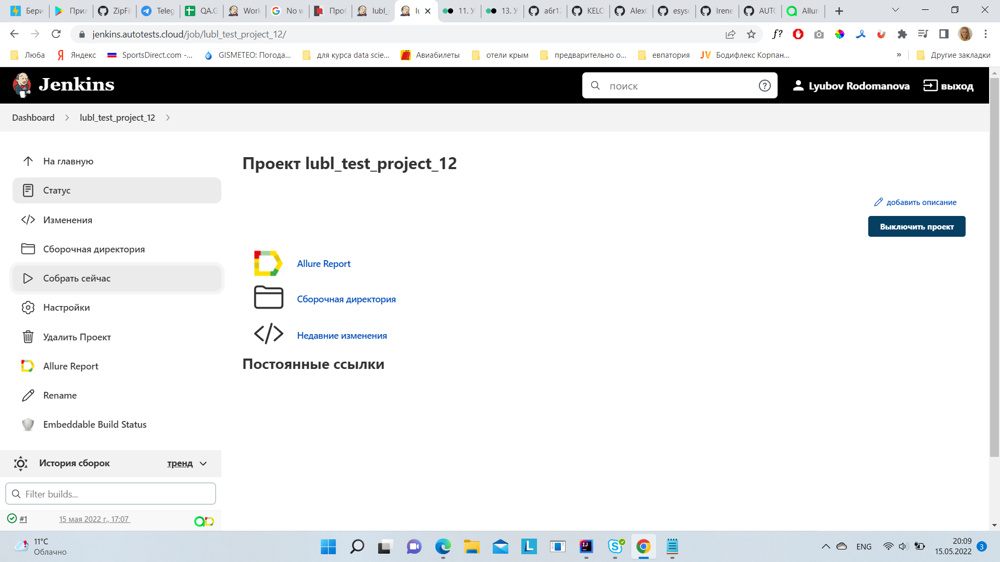
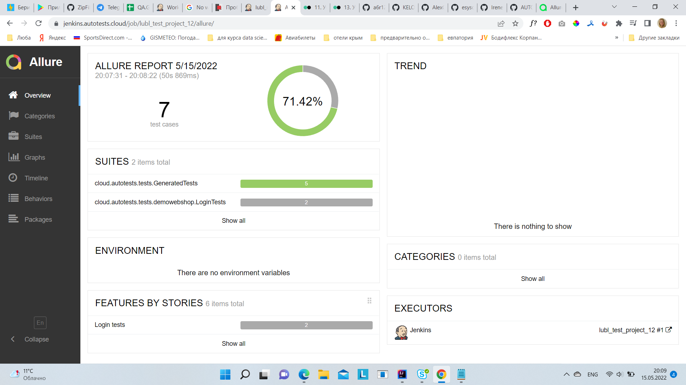
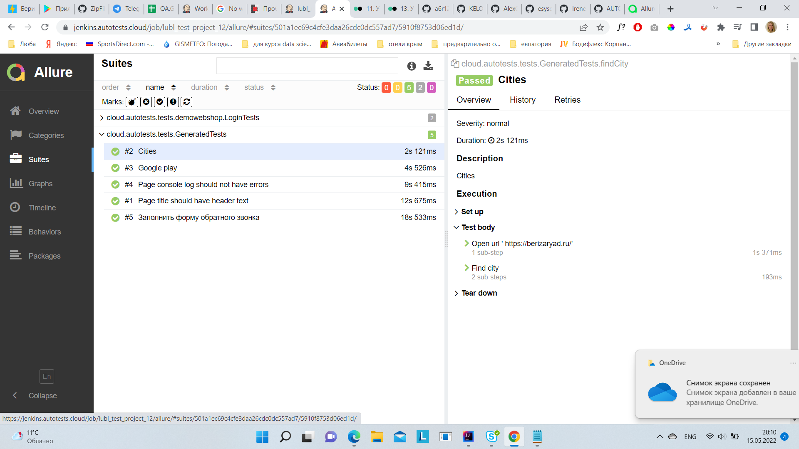
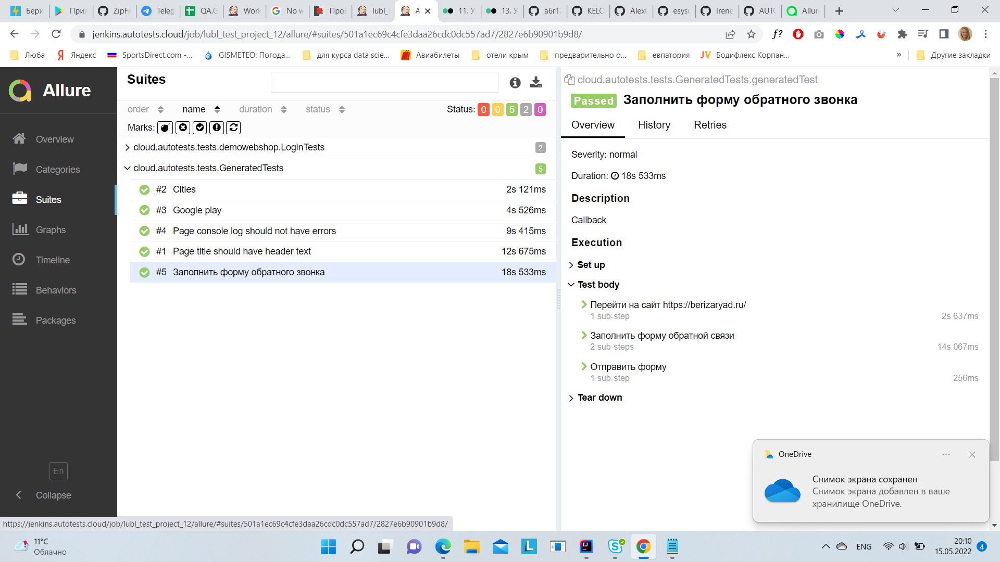
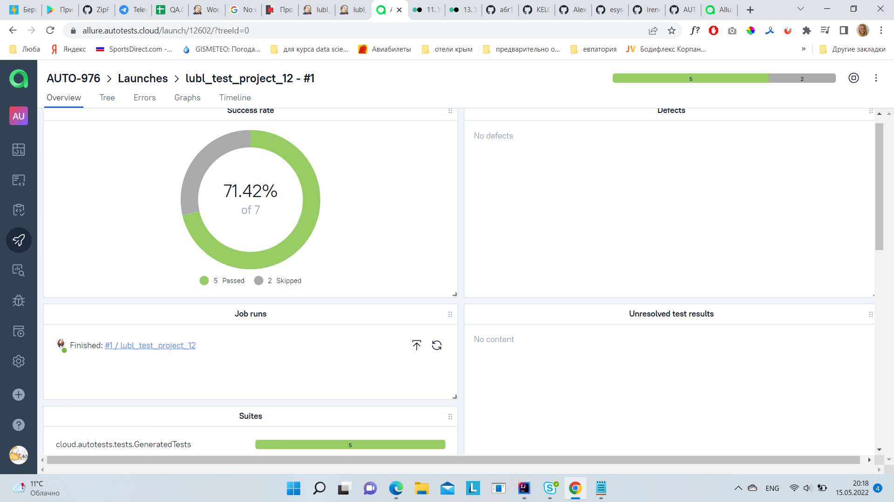
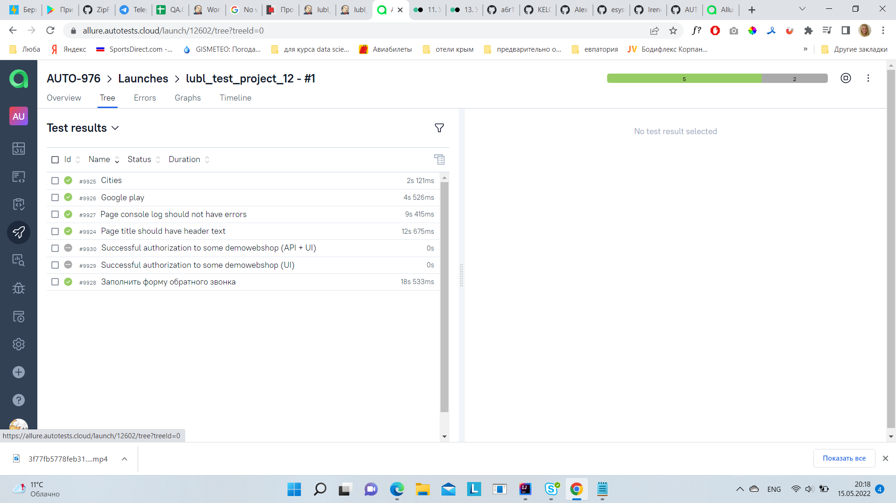
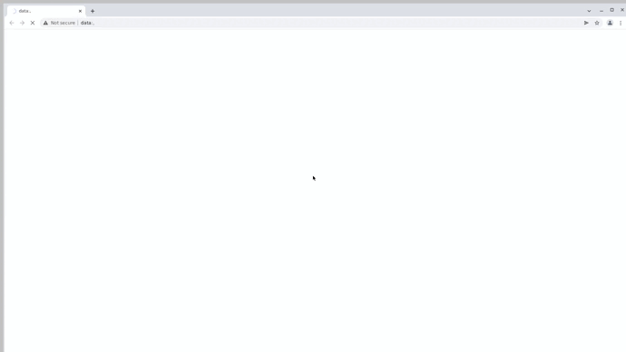

## Проект по автоматизации тестирования сайта berizaryad.ru"
#### Городской сервис аренды зарядок  
> <a target="_blank" href="https://berizaryad.ru/">Ссылка на главную страницу сайта</a>
### 

###  Содержание:

- Технологии и инструменты
- Реализованные проверки
- Сборка в Jenkins
- Запуск из терминала
- Allure отчет
- Отчет в Telegram
- Видео примеры прохождения тестов


###  Проект реализован с использованием
IntelliJ IDEA Java Gradle Selenide Selenoid JUnit5 Jenkins Allure Report Allure TestOps Telegram Jira
<p align="center">


</p>

###  Список проверок, реализованных в автотестах
- [x] Заполнение формы обратного звонка
- [x] Проверка номера телефона на главной странице
- [x] Проверка кнопки скачивания приложения в Google play 
- [x] Проверка  списка городов, где предоставляется услуга
- [x] Проверка на наличие ошибок в console log


###   Сборка в Jenkins
###  Запуск тестов в Jenkins


<p align="center">
  
</p>

### Удаленный запуск тестов

```bash
gradle clean test 
-Dbrowser=${BROWSER}
-DbrowserVersion=${BROWSER_VERSION}
-DbrowserSize=${BROWSER_SIZE}
-Dremote=${REMOTE}

```
### Параметры сборки

> <code>BROWSER</code> – браузер, в котором будут выполняться тесты (_по умолчанию - <code>chrome</code>_).
>
> <code>BROWSER_VERSION</code> – версия браузера, в которой будут выполняться тесты (_по умолчанию - <code>91.0</code>_).
>
> <code>BROWSER_SIZE</code> – разрешени окна браузера, в котором будут выполняться тесты (_по умолчанию - <code>1920x1080</code>_).
>
> <code>REMOTE</code> – адрес удаленного сервера, на котором будут запускаться тесты.


### Запуск из терминала
```bash
gradle clean test
```

###  отчет Allure Report
<p align="center">
  
</p>

<p align="center">
  
</p>

<p align="center">
  
</p>


###  Интеграция с Allure TestOps
<p align="center">
  
</p>

<p align="center">
  
</p>


###  Отчет в Telegram

<p align="center">
  
</p>

### Видео прохождения тестов

> К каждому тесту в отчете прилагается видео.
<p align="center">
  
</p>
